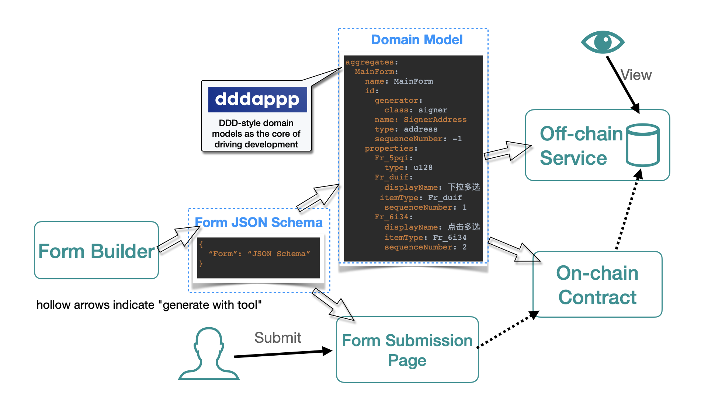

# README

This is a demo of Move Forms.

Move Forms is a No-Code tool. It is based on [dddappp](https://www.dddappp.org), the Low-Code Development Platform.

Here we need to clarify the difference between Low-Code and No-Code.

* Low-Code is for professional developers.

    There is a consensus  (de facto standard)  in the industry on what the core features of a Low-Code platform should have.

    The bottom line is that they must take a "model-driven" approach. For our discussion of this, see: https://www.dddappp.org/#what-is-a-true-low-code-development-platform

* No-Code refers to a large category of tools for "end-users". 

    There is no standardization on what is considered No-Code.
  
    They allow users to create simple applications such as product advertisement pages, online questionnaires, personal blogs, etc.

As can see from this demo, Low-Code has powerful capabilities that can support No-Code tool implementations.

## How Move Forms Works

The following explains how Move Forms works.



* First, you use Form Builder to design a form.
* Then, you can export the schema of this form.
* We use a command line tool to convert the schema into a domain model, from which we can generate on-chain contract and off-chain service.
* In addition, we can use a tool to generate a form submission page from the schema.
* Then end-users can fill out and submit the form.
* You can view the submitted data via the off-chain service.

## Prerequisites

Currently, the dddappp low-code tool is published as a Docker image for developers to experience.

The off-chain services generated by the tool are written in Java and use the MySQL database by default.

So before getting started, you need to:

* Install [Aptos CLI](https://aptos.dev/tools/install-cli/).
* Install [Docker](https://docs.docker.com/engine/install/).
* Install `curl`.
* ~~(Optional) Install `jp` - commandline JSON processor. We can use `jp` to process Node API returned JSON results when testing contracts.~~
* Install MySQL database server. If you do not want to try to run the off-chain service, you can ignore this step.
* Install JDK and Maven. If you do not want to try to run the off-chain service, you can ignore this step. The off-chain services generated by the tool currently use Java language.

If you have already installed Docker, you can use Docker to run a MySQL database service. For example:

```shell
sudo docker run -p 3306:3306 --name mysql \
-v ~/docker/mysql/conf:/etc/mysql \
-v ~/docker/mysql/logs:/var/log/mysql \
-v ~/docker/mysql/data:/var/lib/mysql \
-e MYSQL_ROOT_PASSWORD=123456 \
-d mysql:5.7
```

## ~~Programming~~

### How to design a form and get its schema

XRender is a form solution open-sourced by Alibaba. It supports designing and rendering forms and submitting form data in JSON format to backends.
It was originally a Web2 solution. But obviously we can improve it and make it work for Web3.

You can use this Form Schema Builder to design a form: https://xrender.fun/schema-builder-online

You can use the *Export (导出)* button to export the form's schema to the clipboard, then save the exported schema as a plain text file.

### Run dddappp Project Creation Tool

We use the XRender form schema file `form-schema/form.json` to generate the DDDML model file. The generated model file is available at `dddml/forms.yaml`.

> **Tip**
>
> About DDDML, here is an introductory article: ["Introducing DDDML: The Key to Low-Code Development for Decentralized Applications"](https://github.com/wubuku/Dapp-LCDP-Demo/blob/main/IntroducingDDDML.md).

In repository root directory, run:

```shell
docker run \
-v .:/myapp \
wubuku/dddappp-aptos:0.0.1 \
--xRenderFormSchema /myapp/form-schema/form.json \
--xRenderFormId AptosFormsDemo \
--dddmlDirectoryPath /myapp/dddml \
--boundedContextName Test.AptosFormsDemo \
--aptosMoveProjectDirectoryPath /myapp/aptos-contracts \
--boundedContextAptosPackageName AptosFormsDemo \
--boundedContextAptosNamedAddress aptos_forms_demo \
--boundedContextJavaPackageName org.test.aptosformsdemo \
--javaProjectsDirectoryPath /myapp/aptos-java-service \
--javaProjectNamePrefix aptosformsdemo \
--pomGroupId test.aptosformsdemo
```

The command parameters above are straightforward:

* The first line indicates mounting your local directory into the `/myapp` directory inside the container.
* `xRenderFormSchema` is the path of XRender form schema file. It should be a readable file path in the container.
* `xRenderFormId` is the ID of XRender form. It's recommended to use PascalCase naming style.
* `dddmlDirectoryPath` is the directory where DDDML model files are located. It should be a readable directory path in the container.
* Interpret the value of (optional) parameter `boundedContextName` as the name of your application you want to develop. When there are multiple parts in your name, separate them with dots and use PascalCase naming style for each part. Bounded-context is a term in Domain-driven design (DDD) that refers to a specific problem domain scope that contains specific business boundaries, constraints, and language. If you don't understand this concept for now, it's not a big deal.
* `aptosMoveProjectDirectoryPath` is directory path where on-chain Aptos contract code is placed. It should be a readable and writable directory path in container.
* (Optional) `boundedContextAptosPackageName` is package name of on-chain Aptos contracts. It's recommended to use PascalCase naming style.
* (Optional) `boundedContextAptosNamedAddress` is default named address of on-chain Aptos contracts. It's recommended to use snake_case naming style.
* (Optional) `boundedContextJavaPackageName` is Java package name of off-chain service. According to Java naming conventions, it should be all lowercase and parts should be separated by dots.
* `javaProjectsDirectoryPath` is directory path where off-chain service code is placed. Off-chain service consists of multiple modules (projects). It should be a readable and writable directory path in container.
* (Optional) `javaProjectNamePrefix` is name prefix of each module of off-chain service. It's recommended to use an all-lowercase name.
* (Optional) `pomGroupId` is GroupId of off-chain service. We use Maven as project management tool for off-chain service. It should be all lowercase and parts should be separated by dots.

If you don't specify the optional parameters, the tool will derive them based on `xRenderFormId`.

After executing above command successfully, a directory `aptos-contracts` should be added to local current directory.

## Test Example

### Compile Aptos Move contracts

#### Some preparatory work that may need to be done

It should be noted that below we assume that you will publish the Move contract to the Aptos devnet, so we skip the explanation of the modifications to some configuration files required for publishing to other networks.

We can create a new account on devnet to perform the following test.

Confirm that Aptos CLI is installed and enter the directory `aptos-contracts`, then run:

```shell
aptos init
# Press Enter to confirm using the default values:
aptos account fund-with-faucet --account default --amount 50000000000
# View Aptos Profiles:
aptos config show-profiles
```

It should display similar information:

```shell
{
  "Result": {
    "default": {
      "has_private_key": true,
      "public_key": "...",
      "account": "{ACCOUNT_ADDRESS}",
      "rest_url": "https://fullnode.devnet.aptoslabs.com",
      "faucet_url": "https://faucet.devnet.aptoslabs.com"
    }
  }
}
```

#### Contract dependencies

Note that the form contract depends on a utility package in this project: https://github.com/dddappp/XRender-Form-Utils

We need to publish this package on chain first, and then we can compile the form contract. 
In the following command, we assume that the package is published at address `0x71df3ab1b6cf015aa5870a8a6e8ee0951c54e8d7d79bb59fa3b737c3a38fb93b`.

#### Compile form contract

In the directory `aptos-contracts`, execute the compilation, which should now succeed:

```shell
aptos move compile --named-addresses aptos_forms_demo=default,xrender_form_utils=0x71df3ab1b6cf015aa5870a8a6e8ee0951c54e8d7d79bb59fa3b737c3a38fb93b
```

At this point, the coding phase of the application development is complete! Isn't it very simple?

---

Next, we will deploy and test the Demo application.

### Publish the Aptos contract

Execute the following command in the directory `aptos-contracts` to publish the contract on chain:

```shell
aptos move publish --named-addresses aptos_forms_demo=default,xrender_form_utils=0x71df3ab1b6cf015aa5870a8a6e8ee0951c54e8d7d79bb59fa3b737c3a38fb93b --assume-yes
```

If the command is executed successfully, it should display similar information:

```shell
{
  "Result": {
    "transaction_hash": "{TRANSACTION_HASH}"
    "gas_used": 20722,
    "gas_unit_price": 100,
    "sender": "{ACCOUNT_ADDRESS}",
    "sequence_number": 0,
    "success": true,
    "timestamp_us": 1688909362156606,
    "version": 11446005,
    "vm_status": "Executed successfully"
  }
}
```

Initialize the contract first:

```shell
aptos move run --function-id 'default::aptos_forms_demo_init::initialize' --assume-yes
```

> **Tip**
> 
> Once the contract is published, you can use Aptos Explorer's Modules | Run feature to test it.
> Here is an example form we've already deployed on testnet: https://explorer.aptoslabs.com/account/0xf0ee3187beaa48e56def59dbe52d7e932c3e559c28ae26568fa91ff9ae85e145/modules/run/aptos_forms_demo_main_form_aggregate/submit?network=testnet

### Generate submission page from schema

We're still refining the tool for this step…

#### Publish form submission page

We're still refining the tool for this step…

This is a published form submission page: https://low-code-demo-gold.vercel.app/

## Test Off-chain Service

After running the dddappp tool, an Off-chain service project will be generated in the `aptos-java-service` directory.
It can pull application events and entity states on the chain into the off-chain database, and provides query APIs.

### Prerequisites

The off-chain services generated by the tool are written in Java and use the MySQL database by default.

So before getting started, you need to set up a basic Java development environment:

* Install JDK and [Maven](https://maven.apache.org).
* Install MySQL database server.

If you have already installed Docker, you can use Docker to run a MySQL database service. For example:

```shell
sudo docker run -p 3306:3306 --name mysql \
-v ~/docker/mysql/conf:/etc/mysql \
-v ~/docker/mysql/logs:/var/log/mysql \
-v ~/docker/mysql/data:/var/lib/mysql \
-e MYSQL_ROOT_PASSWORD=123456 \
-d mysql:5.7
```

### Creating and Initialize Database for Off-Chain Service

Use a MySQL client to connect to the local MySQL server and execute the following script to create an empty database (assuming the name is `test2`):

```sql
CREATE SCHEMA `test2` DEFAULT CHARACTER SET utf8mb4 COLLATE utf8mb4_bin;
```

Go to the `aptos-java-service` directory and package the Java project:

```shell
mvn package
```

Then, run a command-line tool to initialize the database:

```shell
java -jar ./{form_id}-service-cli/target/{form_id}-service-cli-0.0.1-SNAPSHOT.jar ddl -d "./scripts" -c "jdbc:mysql://127.0.0.1:3306/test2?enabledTLSProtocols=TLSv1.2&characterEncoding=utf8&serverTimezone=GMT%2b0&useLegacyDatetimeCode=false" -u root -p 123456
```

### Configuring Off-Chain Service

Open the `application-test.yml` file located in the directory `aptos-java-service/{form_id}-service-rest/src/main/resources` and set the published contract address.
After setting, it should look like this:

```yaml
aptos:
  contract:
    address:
      "0xd19e5d4634d89efe118138177628d8b2137918bb634fe461ce6061c99a56a0be"
    node-api:
      base-url: "https://fullnode.devnet.aptoslabs.com/v1"
      # if use testnet:
      #base-url: "https://fullnode.testnet.aptoslabs.com/v1"
```

### Starting Off-Chain Service

In the `aptos-java-service` directory, run the following command to start the off-chain service:

```shell
mvn -pl {form_id}-service-rest -am spring-boot:run
```

### Query Off-chain Service APIs

You can use the following command to query posts:

```shell
curl http://localhost:1023/api/MainForms
```


## Tips

### Update dddappp Docker Image

Since the dddappp v0.0.1 image is updated frequently, you may be required to manually delete the image and pull it again before `docker run`.

```shell
# If you have already run it, you may need to Clean Up Exited Docker Containers first
docker rm $(docker ps -aq --filter "ancestor=wubuku/dddappp-aptos:0.0.1")
# remove the image
docker image rm wubuku/dddappp-aptos:0.0.1
# pull the image
git pull wubuku/dddappp-aptos:0.0.1
```

### Using This Cheatsheet

Here it is a cheatsheet on how to use the Aptos Client CLI to call on-chain contracts: [AptosMoveCLICheatsheet](./aptos-contracts/AptosMoveCLICheatsheet.md)

The parameters you need to fill in are placeholders containing their type and meaning (name). You can copy these commands, modify them as needed, and execute them directly in a terminal.


### Get Resource Account Address

Our contracts use a separate resource account to hold data of form.

You can get the address of this resource account by using the following command:

```shell
curl https://fullnode.devnet.aptoslabs.com/v1/accounts/{ACCOUNT_ADDRESS}/resource/{ACCOUNT_ADDRESS}::resource_account::ResourceAccount
```

The output is similar to the following:

```json
{"type":"{ACCOUNT_ADDRESS}::resource_account::ResourceAccount","data":{"cap":{"account":"{RESOURCE_ACCOUNT_ADDRESS}"}}}
```

In the location `{RESOURCE_ACCOUNT_ADDRESS}` above, the address of the resource account will be displayed.

### Getting Form Submission Events

Execute the following command, noting the replacement of the placeholders `{RESOURCE_ACCOUNT_ADDRESS}` and `{ACCOUNT_ADDRESS}`:

```shell
curl --request GET \
  --url 'https://fullnode.testnet.aptoslabs.com/v1/accounts/{RESOURCE_ACCOUNT_ADDRESS}/events/{ACCOUNT_ADDRESS}::aptos_forms_demo_main_form::Events/aptos_forms_demo_main_form_submitted_handle?start=0&limit=10' \
  --header 'Accept: application/json'
```

For example:

```shell
curl --request GET \
  --url 'https://fullnode.testnet.aptoslabs.com/v1/accounts/0xd2700787f8440e63143653a734cd42bde662e201fca7d5754acd269e6e79ff96/events/0xf0ee3187beaa48e56def59dbe52d7e932c3e559c28ae26568fa91ff9ae85e145::aptos_forms_demo_main_form::Events/aptos_forms_demo_main_form_submitted_handle?start=0&limit=10' \
  --header 'Accept: application/json'
```

### Get Form Table Handle

```shell
curl 'https://fullnode.devnet.aptoslabs.com/v1/accounts/{RESOURCE_ACCOUNT_ADDRESS}/resource/{ACCOUNT_ADDRESS}::aptos_forms_demo_main_form::Tables'
```

The output is similar to the following:

```json
{"type":"{ACCOUNT_ADDRESS}::aptos_forms_demo_main_form::Tables","data":{"aptos_forms_demo_main_form_table":{"handle":"{FORM_TABLE_HANDLE}"}}}
```

In the location `{FORM_TABLE_HANDLE}` above, the form table handle will be displayed.
